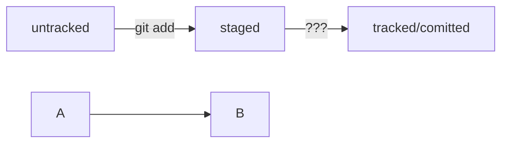

# Начало работы с проектор + markdown  

Выполняет Кузнецов Виктор 2 курс мяса  

чтобы удалить папку с файлами нужно  

```bash
rm -rf namefolder
```


 


еще команды которые стоит упомянуть  
---
ls - list всего что есть  
pwd - print working dir  
rm - remove, flags -f force -r recursive если есть папки  
git config --global user.name "VIKTOR"  
git add  
git remote add origin link  
git push -u origin main  
git log --oneline - логи коммитов  
в head хранится ссылка на ласт коммит  
хеш испльзуется sha-1   
Это конец записи.
