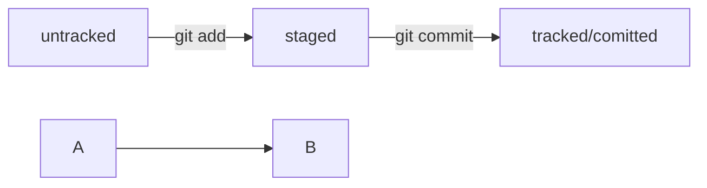

# Начало работы с проектор + markdown  

Выполняет Кузнецов Виктор 2 курс мяса  

чтобы удалить папку с файлами нужно  

```bash
rm -rf namefolder
```


 


еще команды которые стоит упомянуть  
---
ls - list всего что есть  
pwd - print working dir  
rm - remove, flags -f force -r recursive если есть папки  
git config --global user.name "VIKTOR"  
git add  
git remote add origin link  
git push -u origin main  
git log --oneline - логи коммитов  
в head хранится ссылка на ласт коммит  


хеш испльзуется sha-1   
## Как исправить коммит  
есть такая команда --amemd  
пишется так **git commit --amend --no-edit**  
можно еще флаг поменять на -m 'comment'  
## Откат изменения
git restore --staged <file> это чтобы отменить изменения  
для этой команды еще можно написать . и тогда все файлы вернутся в untracked  
git reset --hard <commit hash> удаляет все коммиты которые идут после hash и добавляет ссылку head но этот коммит  
git restore file - октатывает файл до состояния tracked

Это конец записи.
